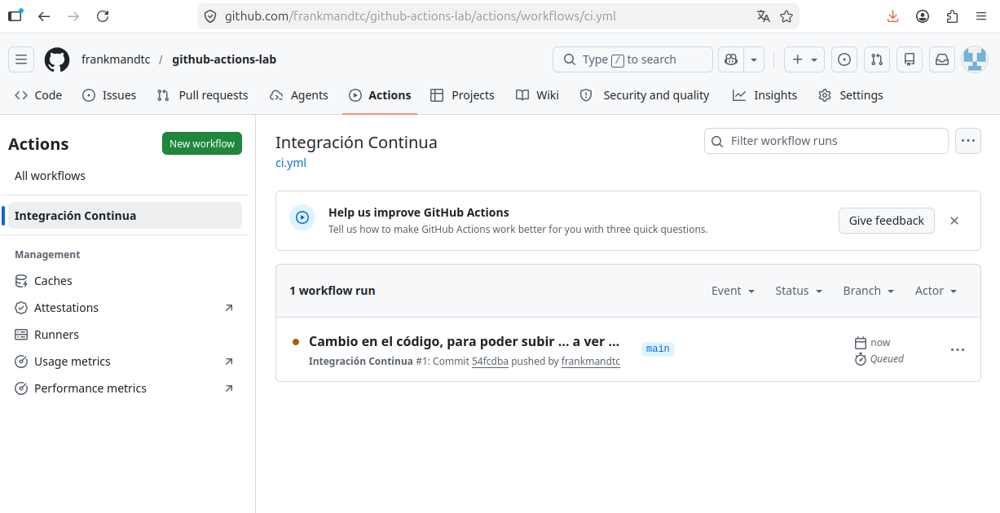
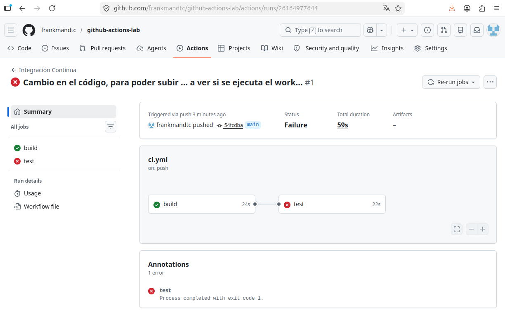
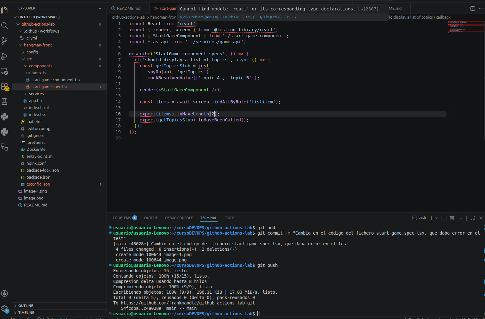
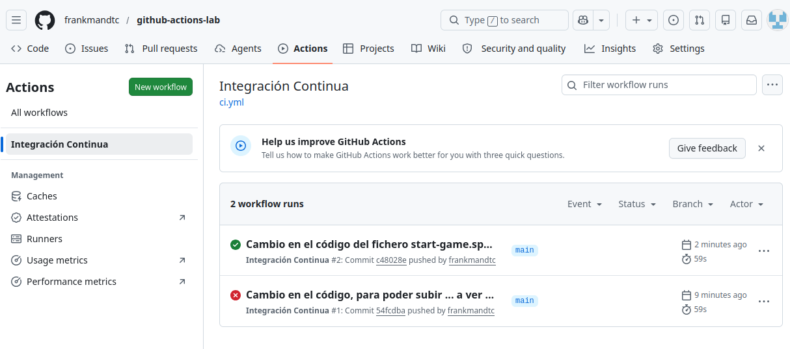
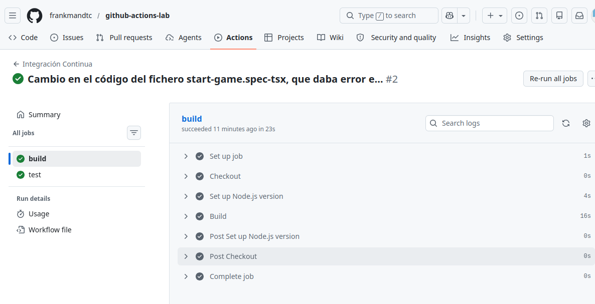
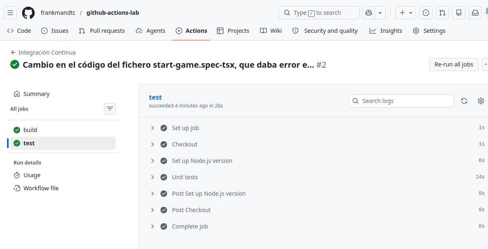
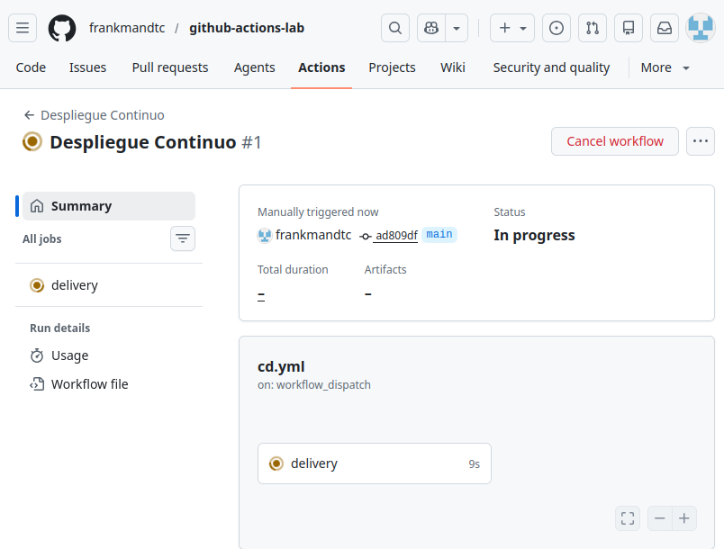
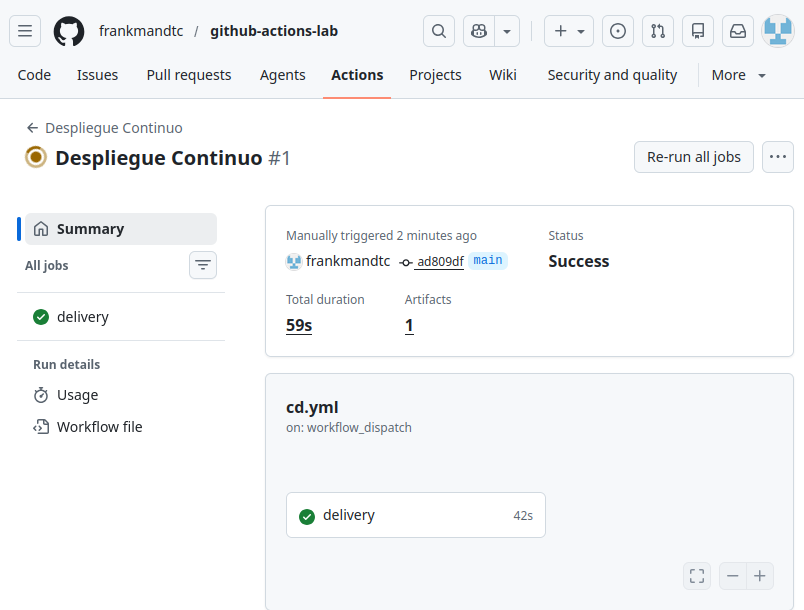
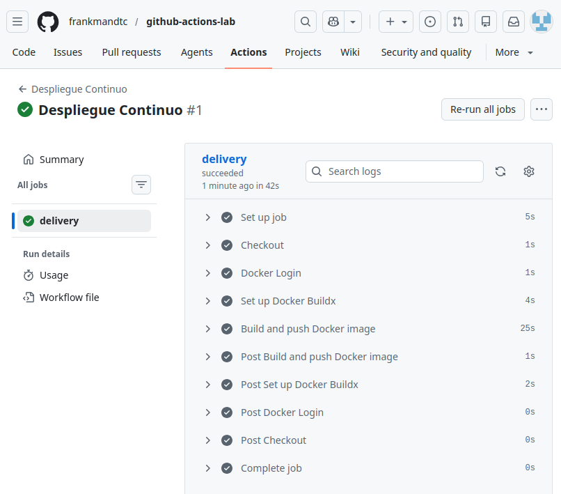
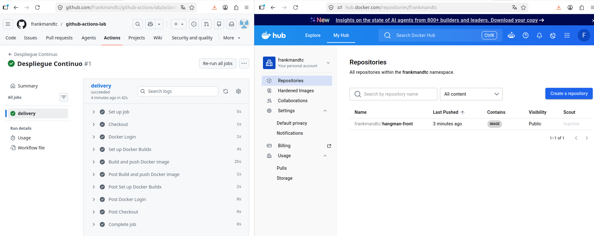

# 1.- Workflow CI para el proyecto de frontend
Vamos a crear un workflow en Github para el proyecto hangman-front, donde vamos a usar CI para automatizar el build y los test unitarios del proyecto cuando hay cambios (push o pull requests) en la rama main.
La configuracioón del workflow sería el guardado en ci.yml, que se encuentra dentro de la carpeta .github/workflows (está en el repo).
El código quedaría así:
```
name: Integración Continua

on:
  push:
    branch: [ main ]
    paths: [ 'hangman-front/**']
  pull_request:
    branches: [ main ]
    paths: [ 'hangman-front/**']

jobs:
  build:
    runs-on: ubuntu-latest

    steps:
      - name: Checkout
        uses: actions/checkout@v6
      - name: Set up Node.js version
        uses: actions/setup-node@v6
        with:
          node-version: 18
      - name: Build
        working-directory: ./hangman-front
        run: |
          npm ci
          npm run build
  
  test:
    runs-on: ubuntu-latest
    needs: build

    steps:
      - name: Checkout
        uses: actions/checkout@v6
      - name: Set up Node.js version
        uses: actions/setup-node@v6
        with:
          node-version: 18
      - name: Unit tests
        working-directory: ./hangman-front
        run: |
          npm ci
          npm run test
```


Vamos a definir los eventos de nuestro workflow: push y pull_request. Esto indica que cuando se produzca alguno de estos 2 eventos en nuestro github, lanzaremos los trabajos (jobs)

La primera prueba (haciendo un push) no me funciona (no se ejecuta el workflow). Recordando la clase on line del otro día, me doy cuenta que necesito cambiar algo del código fuente para que se lance.

Pero veo que se produce un error en el trabajo "test"

**Afortunadamente**, este mismo fallo le surgió a un compañero, y me indica el lugar en el que hay que realizar una modificación ( fichero *start-game.spec-tsx*)
Hago el cambio que me comenta y actualizo el repo en github

Y compruebo que esta vez se ha ejecutado el Workflow Integración Continua de forma satisfactoria


Compruebo el trabajo **"build"** y todos los pasos que se han realizado

Igual ocurre con el **"test"**


# 2.- Workflow CD para el proyecto de frontend
Vamos a crear el fichero cd.yml, que tendrá un workflow de Despliegue continuo, que se encargará de llevar el código ya validado a un entorno "real". Pondremos que la ejecución se hará manual (workflow_dispatch) desde la interfaz de GitHub.
```
name: Despliegue Continuo

on:
  workflow_dispatch:

jobs:
  delivery:
    runs-on: ubuntu-latest
    permissions:
      contents: read
      packages: write

    steps:
      - name: Checkout
        uses: actions/checkout@v6
      - name: Docker Login
        uses: docker/login-action@v4
        with:
          username: ${{ vars.DOCKER_USERNAME }}
          password: ${{ secrets.DOCKER_PASSWORD }}
     - name: Set up Docker Buildx
        uses: docker/setup-buildx-action@v4
      - name: Build and push Docker image
        uses: docker/build-push-action@v7
        with:
          push: true
          tags: frankmandtc/hangman-front:latest
          context: ./hangman-front
```

Una vez creadas las variables de nuestra cuenta de DOCKER HUB, debería funcionarnos. Lanzamos el workflow "Despliegue continuo" de forma manual



Vemos que ha funcionado correctamente



Observamos todos los trabajos que ha realizado de forma satisfactoria



Y para comprobar que ha funcionado perfectamente, entramos en My Hub de mi cuenta de Docker HUB y vemos que está dicho repositorio

